# 🔄 Hospital Management System - Application Flowcharts

## 📋 Table of Contents
1. [High-Level System Architecture](#high-level-system-architecture)
2. [User Journey Flowcharts](#user-journey-flowcharts)
3. [Module Interaction Flowcharts](#module-interaction-flowcharts)
4. [Data Flow Diagrams](#data-flow-diagrams)
5. [Authentication & Authorization Flow](#authentication--authorization-flow)
6. [Multi-Tenant Architecture Flow](#multi-tenant-architecture-flow)

---

## 🏗️ High-Level System Architecture

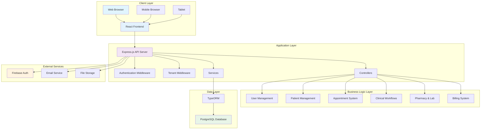

---

## 👥 User Journey Flowcharts

### 1. Patient Registration & Login Flow

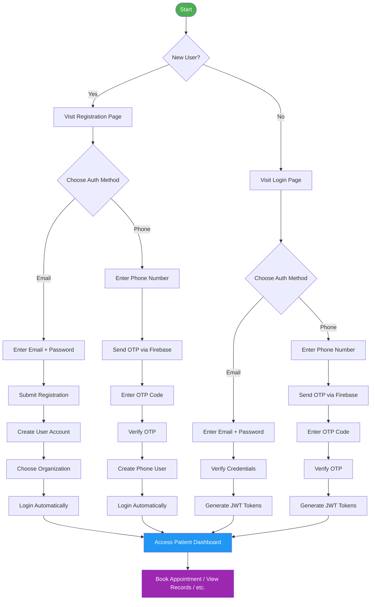

### 2. Doctor Workflow Flowchart

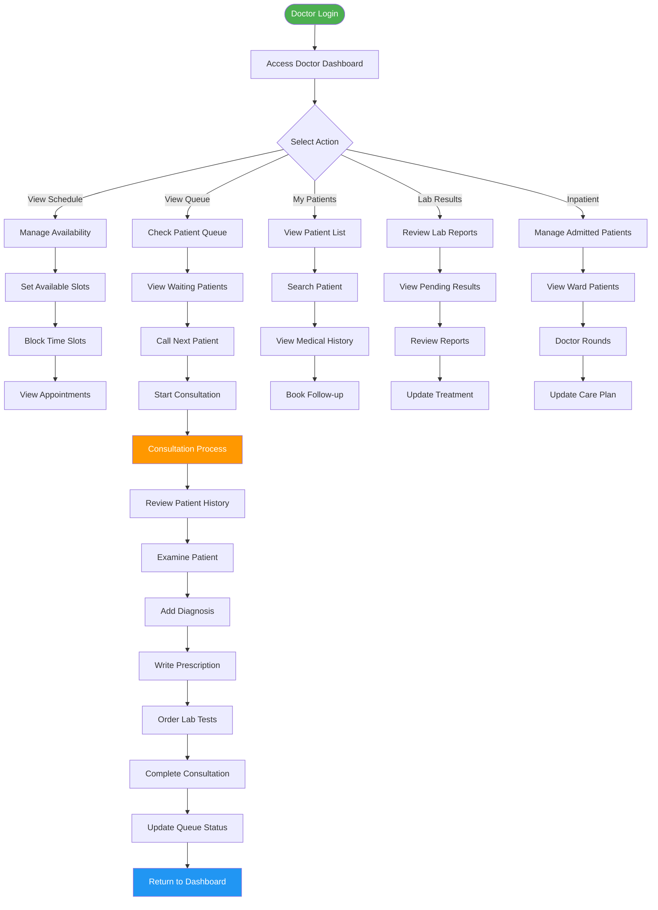

### 3. Receptionist Workflow Flowchart

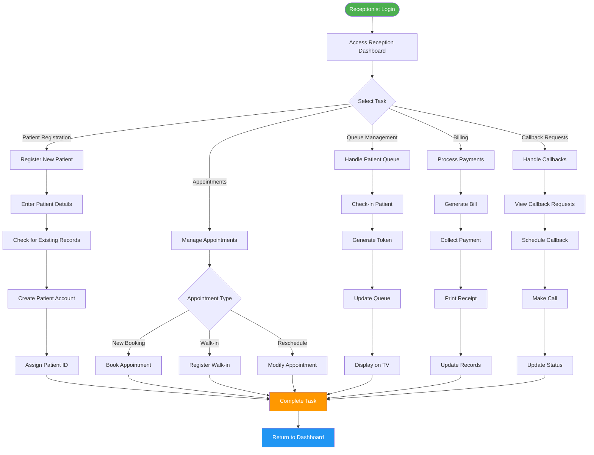

---

## 🔄 Module Interaction Flowcharts

### 1. Appointment Booking Flow

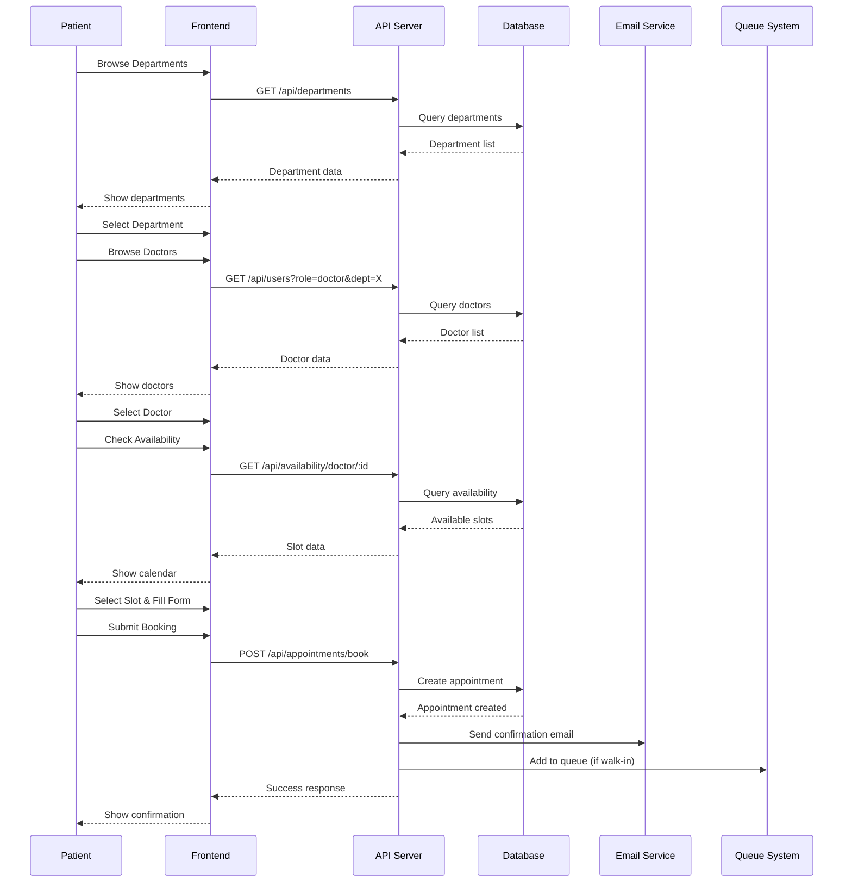

### 2. Doctor Consultation Flow

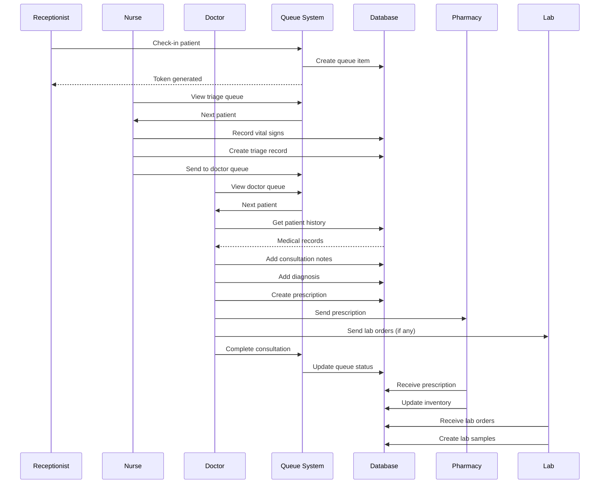

### 3. Pharmacy Dispensing Flow

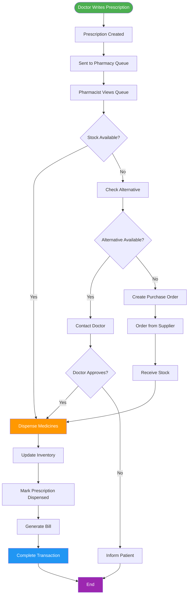

---

## 📊 Data Flow Diagrams

### 1. Patient Data Flow

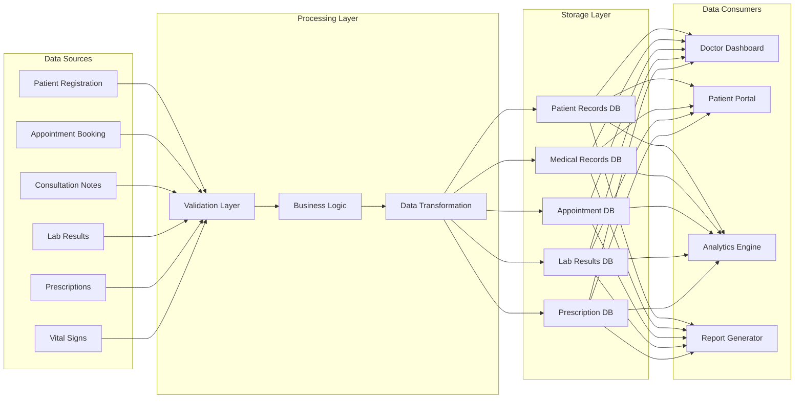

### 2. Multi-Tenant Data Isolation Flow

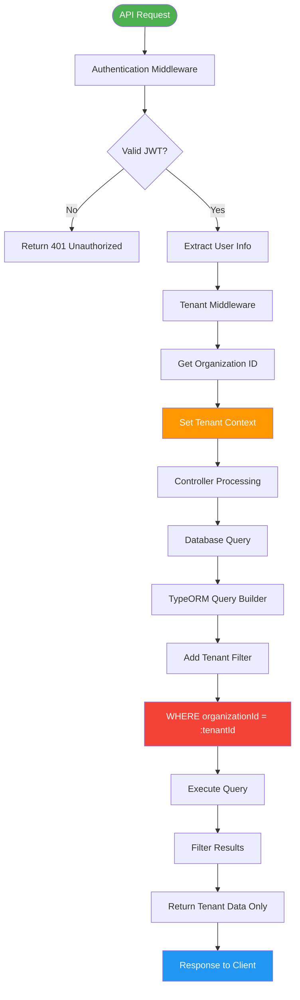

---

## 🔐 Authentication & Authorization Flow

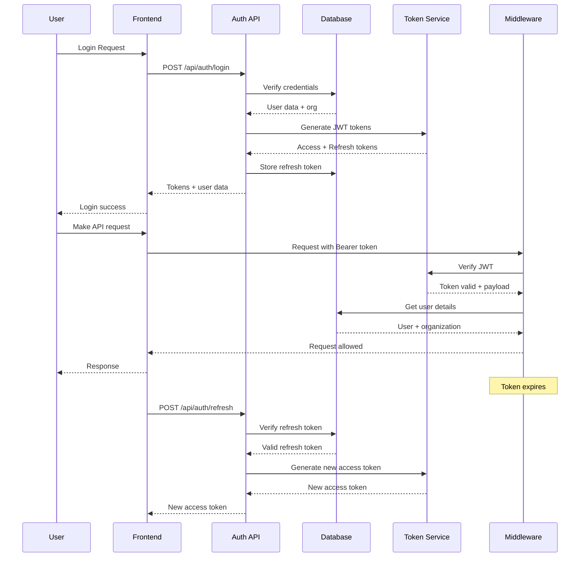

---

## 🏢 Multi-Tenant Architecture Flow

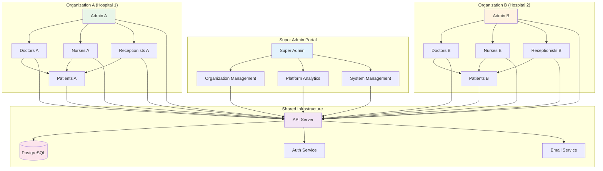

---

## 🏥 Complete Patient Journey Flow

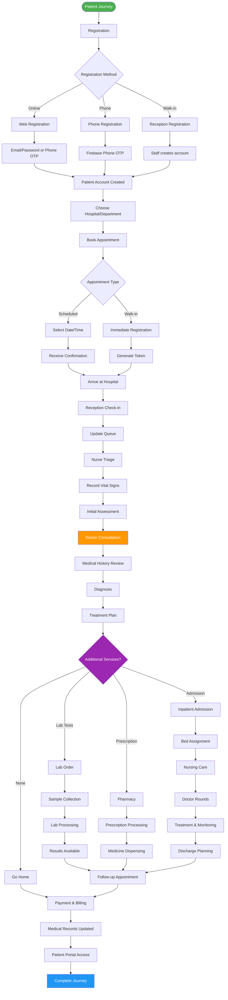

---

## 🔄 Real-time Queue Management Flow

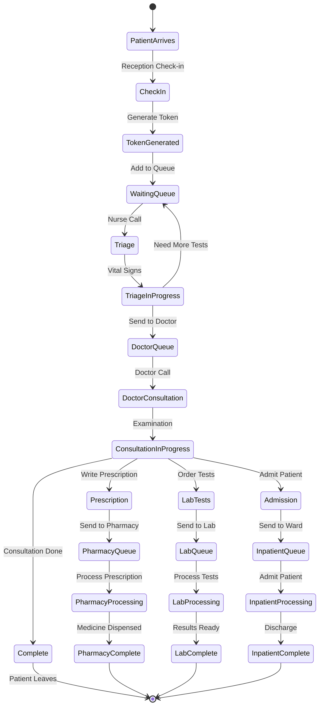

---

## 📱 Mobile-First Patient Portal Flow

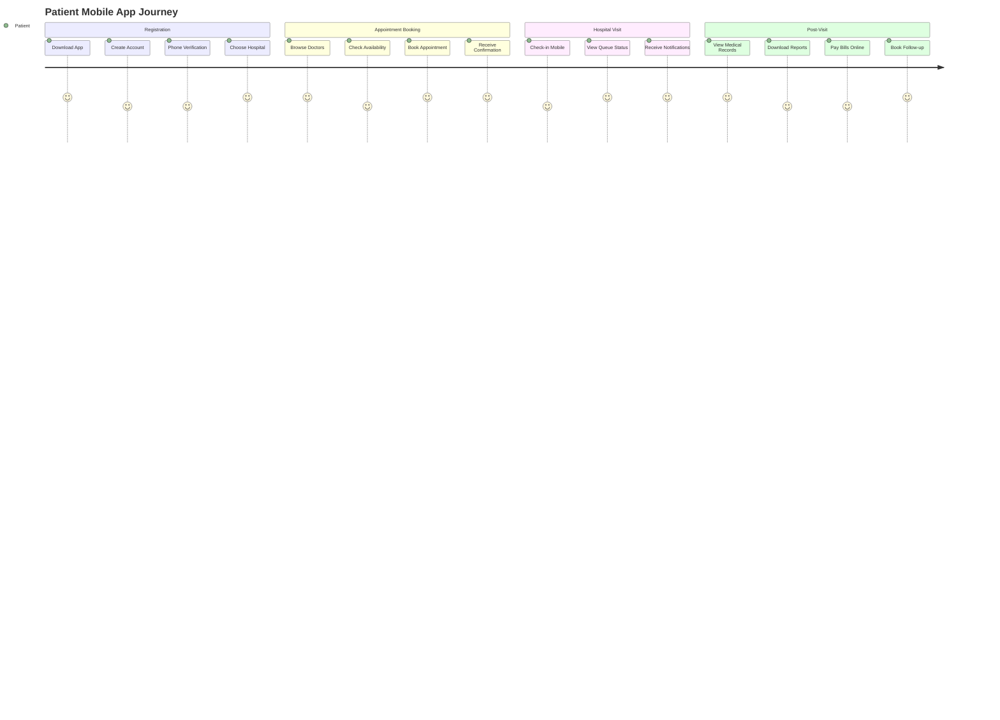

---

## 🔗 System Integration Flow

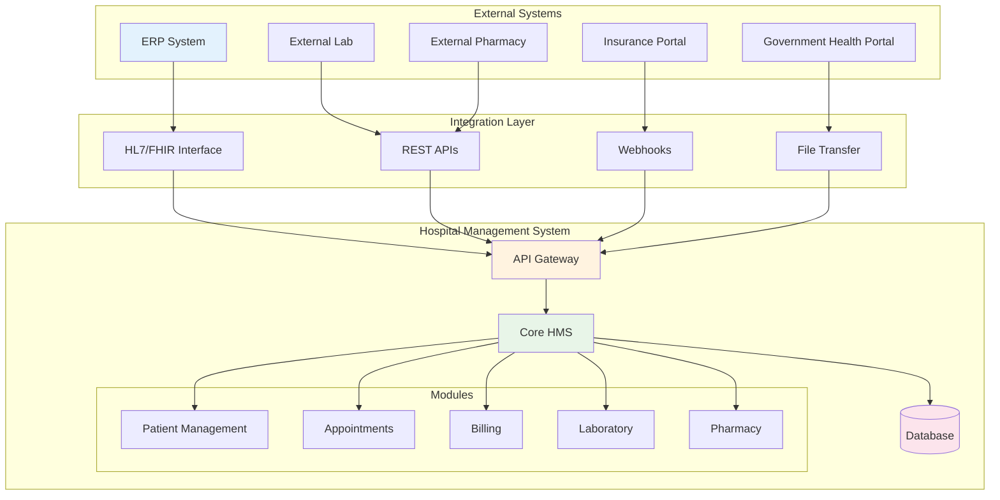

---

## 📊 Analytics & Reporting Flow

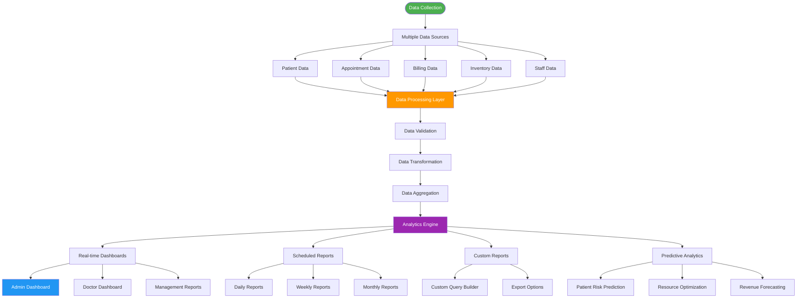

---

## 🎯 Key Insights from Flowcharts

### **System Complexity**
- **50+ interconnected processes**
- **8 different user roles** with unique workflows
- **Multi-tenant architecture** with data isolation
- **Real-time queue management** system

### **Critical Integration Points**
1. **Authentication Gateway** - Single entry point for all users
2. **Queue Management System** - Core patient flow coordinator
3. **Database Layer** - Centralized data with tenant isolation
4. **External Services** - Firebase, Email, SMS integrations

### **Data Flow Patterns**
- **Linear flows** for patient registration and booking
- **Parallel processing** for pharmacy and lab orders
- **Real-time updates** for queue management
- **Batch processing** for analytics and reporting

### **Security & Compliance**
- **JWT-based authentication** with refresh tokens
- **Role-based access control** at every level
- **Tenant data isolation** in multi-tenant setup
- **Audit logging** for all critical operations

---

## 📝 How to Use These Flowcharts

1. **For Development Teams**: Use module interaction flows to understand system dependencies
2. **For Business Analysts**: Use user journey flows to map business processes
3. **For System Administrators**: Use architecture flows for deployment planning
4. **For Training**: Use workflow diagrams to train new staff
5. **For Documentation**: Include in technical documentation and user manuals

---

**Last Updated:** February 10, 2026  
**Version:** 1.0.0  
**Format:** Mermaid diagrams (compatible with GitHub, VS Code, and documentation tools)
