# 🏢 Organization Setup & Role Management Flowcharts

## 📋 Table of Contents
1. [Complete Organization Setup Flow](#complete-organization-setup-flow)
2. [Role Creation & Assignment Flow](#role-creation--assignment-flow)
3. [Department & Service Setup Flow](#department--service-setup-flow)
4. [Staff Onboarding Flow](#staff-onboarding-flow)
5. [Location & Facility Setup Flow](#location--facility-setup-flow)
6. [System Configuration Flow](#system-configuration-flow)
7. [Multi-Location Organization Flow](#multi-location-organization-flow)

---

## 🏢 Complete Organization Setup Flow


---

## 👥 Role Creation & Assignment Flow


---

## 🏥 Department & Service Setup Flow

```mermaid
flowchart TD
    Start([Admin Login]) --> A[Setup Departments]
    
    A --> B[Add Clinical Departments]
    B --> B1[General Medicine]
    B --> B2[Pediatrics]
    B --> B3[Cardiology]
    B --> B4[Orthopedics]
    B --> B5[Gynecology]
    B --> B6[Neurology]
    B --> B7[Dermatology]
    B --> B8[Emergency]
    
    A --> C[Add Support Departments]
    C --> C1[Laboratory]
    C --> C2[Pharmacy]
    C --> C3[Radiology]
    C --> C4[Physiotherapy]
    C --> C5[Nutrition]
    C --> C6[Mental Health]
    
    B1 --> D[Configure Department Details]
    B2 --> D
    B3 --> D
    B4 --> D
    B5 --> D
    B6 --> D
    B7 --> D
    B8 --> D
    C1 --> D
    C2 --> D
    C3 --> D
    C4 --> D
    C5 --> D
    C6 --> D
    
    D --> D1[Department Name]
    D --> D2[Department Code]
    D --> D3[Head of Department]
    D --> D4[Location/Floor]
    D --> D5[Contact Number]
    D --> D6[Operating Hours]
    D --> D7[Service Description]
    
    D1 --> E[Save Department]
    D2 --> E
    D3 --> E
    D4 --> E
    D5 --> E
    D6 --> E
    D7 --> E
    
    E --> F[Setup Services per Department]
    
    F --> G[General Medicine Services]
    G --> G1[General Consultation]
    G --> G2[Health Checkup]
    G --> G3[Vaccination]
    G --> G4[Chronic Disease Management]
    
    F --> H[Cardiology Services]
    H --> H1[ECG]
    H --> H2[Echocardiogram]
    H --> H3[Stress Test]
    H --> H4[Angiogram]
    
    F --> I[Laboratory Services]
    I --> I1[Blood Tests]
    I --> I2[Urine Tests]
    I --> I3[Biochemistry]
    I --> I4[Microbiology]
    I --> I5[Histopathology]
    
    F --> J[Pharmacy Services]
    J --> J1[Medicine Dispensing]
    J --> J2[Prescription Review]
    J --> J3[Drug Information]
    J --> J4[Vaccination Services]
    
    G1 --> K[Configure Service Details]
    G2 --> K
    G3 --> K
    G4 --> K
    H1 --> K
    H2 --> K
    H3 --> K
    H4 --> K
    I1 --> K
    I2 --> K
    I3 --> K
    I4 --> K
    I5 --> K
    J1 --> K
    J2 --> K
    J3 --> K
    J4 --> K
    
    K --> K1[Service Name]
    K --> K2[Service Code]
    K --> K3[Duration (minutes)]
    K --> K4[Price]
    K --> K5[Requirements]
    K --> K6[Description]
    
    K1 --> L[Save Service]
    K2 --> L
    K3 --> L
    K4 --> L
    K5 --> L
    K6 --> L
    
    L --> M[Department & Services Ready]
    
    style Start fill:#4caf50,color:#fff
    style E fill:#ff9800,color:#fff
    style L fill:#2196f3,color:#fff
    style M fill:#9c27b0,color:#fff
```

---

## 👨‍⚕️ Staff Onboarding Flow


---

## 🏢 Location & Facility Setup Flow


---

## ⚙️ System Configuration Flow


---

## 🏥 Multi-Location Organization Flow


---

## 🔄 Complete Organization Setup Sequence


---

## 📊 Organization Setup Checklist

```mermaid
flowchart TD
    Start([Organization Setup]) --> A[Basic Information]
    
    A --> A1[✅ Organization Name]
    A --> A2[✅ Contact Details]
    A --> A3[✅ License Information]
    A --> A4[✅ Tax Information]
    A --> A5[✅ Address Details]
    
    A1 --> B[Roles & Permissions]
    A2 --> B
    A3 --> B
    A4 --> B
    A5 --> B
    
    B --> B1[✅ Super Admin Role]
    B --> B2[✅ Admin Role]
    B --> B3[✅ Doctor Role]
    B --> B4[✅ Nurse Role]
    B --> B5[✅ Receptionist Role]
    B --> B6[✅ Pharmacist Role]
    B --> B7[✅ Lab Technician Role]
    B --> B8[✅ Patient Role]
    
    B1 --> C[Departments Setup]
    B2 --> C
    B3 --> C
    B4 --> C
    B5 --> C
    B6 --> C
    B7 --> C
    B8 --> C
    
    C --> C1[✅ Clinical Departments]
    C --> C2[✅ Support Departments]
    C --> C3[✅ Department Heads]
    C --> C4[✅ Department Locations]
    
    C1 --> D[Services Configuration]
    C2 --> D
    C3 --> D
    C4 --> D
    
    D --> D1[✅ Medical Services]
    D --> D2[✅ Diagnostic Services]
    D --> D3[✅ Pharmacy Services]
    D --> D4[✅ Emergency Services]
    D --> D5[✅ Pricing Configuration]
    
    D1 --> E[Staff Onboarding]
    D2 --> E
    D3 --> E
    D4 --> E
    D5 --> E
    
    E --> E1[✅ Admin Account Created]
    E --> E2[✅ Doctors Added]
    E --> E3[✅ Nurses Added]
    E --> E4[✅ Receptionists Added]
    E --> E5[✅ Pharmacists Added]
    E --> E6[✅ Lab Technicians Added]
    
    E1 --> F[Facility Setup]
    E2 --> F
    E3 --> F
    E4 --> F
    E5 --> F
    E6 --> F
    
    F --> F1[✅ Building Layout]
    F --> F2[✅ Floor Configuration]
    F --> F3[✅ Room Setup]
    F --> F4[✅ Bed Configuration]
    F --> F5[✅ Equipment Setup]
    
    F1 --> G[System Configuration]
    F2 --> G
    F3 --> G
    F4 --> G
    F5 --> G
    
    G --> G1[✅ Email Settings]
    G --> G2[✅ SMS Settings]
    G --> G3[✅ Billing Configuration]
    G --> G4[✅ Security Settings]
    G --> G5[✅ Backup Configuration]
    
    G1 --> H[Testing & Validation]
    G2 --> H
    G3 --> H
    G4 --> H
    G5 --> H
    
    H --> H1[✅ Email Testing]
    H --> H2[✅ SMS Testing]
    H --> H3[✅ Payment Testing]
    H --> H4[✅ Security Testing]
    H --> H5[✅ Backup Testing]
    
    H1 --> I[Final Setup]
    H2 --> I
    H3 --> I
    H4 --> I
    H5 --> I
    
    I --> I1[✅ Organization Ready]
    I --> I2[✅ All Systems Operational]
    I --> I3[✅ Staff Trained]
    I --> I4[✅ Documentation Complete]
    
    I1 --> J[🎉 Setup Complete!]
    I2 --> J
    I3 --> J
    I4 --> J
    
    style Start fill:#4caf50,color:#fff
    style J fill:#4caf50,color:#fff
```



---

## 🎯 Key Organization Setup Insights

### **Critical Setup Steps:**
1. **Organization Creation** - Legal and business information
2. **Role Definition** - 8 standard roles with permissions
3. **Department Setup** - Clinical and support departments
4. **Service Configuration** - Medical and support services
5. **Staff Onboarding** - User accounts and role assignments
6. **Facility Setup** - Physical layout and resources
7. **System Configuration** - Email, SMS, billing, security
8. **Testing & Validation** - Ensure everything works

### **Multi-Location Considerations:**
- **Master Organization** with branch locations
- **Branch Admins** with limited access
- **Cross-location data sharing** with consent
- **Unified reporting** across all locations
- **Staff rotation** between locations

### **Security & Compliance:**
- **Role-based access control** for all users
- **Data encryption** for sensitive information
- **Audit logging** for all operations
- **Patient consent** for data sharing
- **Backup and recovery** procedures

---

## 📝 How to Use These Flowcharts

### **For Super Admins:**
- Use the complete setup flow to guide organization creation
- Follow the checklist to ensure nothing is missed
- Understand multi-location setup requirements

### **For Organization Admins:**
- Use department and service setup flows
- Follow staff onboarding procedures
- Configure system settings properly

### **For Development Teams:**
- Understand the complete setup process
- Implement validation at each step
- Create proper error handling

### **For Training:**
- Use flowcharts to train new administrators
- Explain role-based access patterns
- Demonstrate multi-location management

---

**Last Updated:** February 10, 2026  
**Version:** 1.0.0  
**Purpose:** Complete organization setup and role management guide
